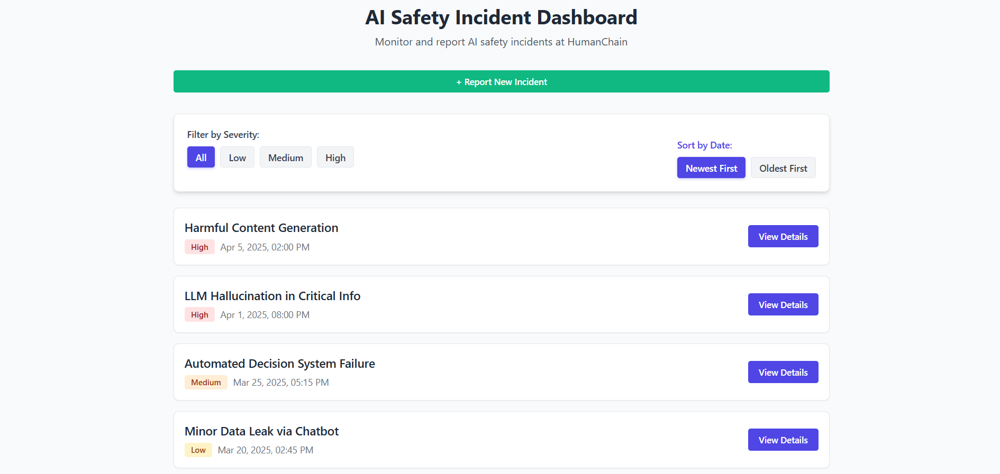

# AI Safety Incident Dashboard

A React-based dashboard for monitoring and reporting AI safety incidents at HumanChain. This application allows users to view existing incidents, filter them by severity, sort them by date, and report new incidents.



## Features

- View a list of AI safety incidents with details
- Filter incidents by severity (Low, Medium, High)
- Sort incidents by date (newest or oldest first)
- Report new AI safety incidents with form validation
- Responsive design for mobile and desktop

## Tech Stack

- **Framework**: React with TypeScript
- **Styling**: Custom CSS with utility classes (similar to Tailwind)
- **State Management**: React Hooks (useState, useEffect)
- **Build Tool**: Vite

## Getting Started

### Prerequisites

- Node.js (v14 or newer)
- npm or yarn

### Installation

1. Clone the repository
```bash
git clone https://github.com/Sachinrajawat/AI-Safety-Incident-Dashboard.git
cd ai-safety-dashboard
```

2. Install dependencies
```bash
npm install
# or
yarn
```

3. Start the development server
```bash
npm run dev
# or
yarn dev
```

4. Open your browser and navigate to `http://localhost:5173`

### Building for Production

To create a production build:
```bash
npm run build
# or
yarn build
```

The build artifacts will be stored in the `dist/` directory.

## Project Structure

```
src/
├── assets/           # Static assets like images
├── components/       # React components
│   ├── FilterControls.tsx
│   ├── IncidentForm.tsx
│   ├── IncidentItem.tsx
│   └── IncidentList.tsx
├── data/             # Mock data for incidents
│   └── mockData.ts
├── types/            # TypeScript type definitions
│   └── incident.ts
├── App.css           # App-specific styles
├── App.tsx           # Main App component
├── index.css         # Global styles
└── main.tsx          # Application entry point
```

## Design Decisions

### UI/UX

- **Modern UI**: Implemented a clean, modern UI with subtle animations and transitions for a polished user experience.
- **Color-coded severity**: Using intuitive color coding (yellow for Low, orange for Medium, red for High) to quickly identify incident severity.
- **Responsive design**: The application is fully responsive with optimized layouts for mobile, tablet, and desktop views.

### Technical Choices

- **TypeScript**: Used for type safety and better developer experience.
- **Mock Data**: Included mock incident data with a simulated loading delay to demonstrate async data fetching.
- **Component Structure**: Separated concerns into modular components for better maintainability.
- **Custom CSS**: Implemented a utility-class based styling system similar to Tailwind CSS but with custom values for complete design control.

### Form Validation

- Form validation is implemented for reporting new incidents:
  - Title requires at least 5 characters
  - Description requires at least 10 characters
  - Severity selection is required

## Future Improvements

- Add user authentication
- Implement real backend API integration
- Add pagination for large incident lists
- Enable incident status tracking and updates
- Implement search functionality
- Add data visualization for incident trends

## License

[MIT](LICENSE)
